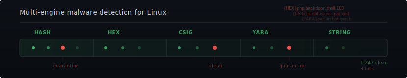

# Linux Malware Detect (LMD)

<p align="center">
  <picture>
    <source media="(prefers-color-scheme: dark)" srcset="assets/banner-dark.svg">
    <source media="(prefers-color-scheme: light)" srcset="assets/banner-light.svg">
    
  </picture>
</p>

<p align="center">
  <a href="https://github.com/rfxn/linux-malware-detect/actions/workflows/smoke-test.yml"></a>
  <a href="CHANGELOG"></a>
  <a href="COPYING.GPL"></a>
  <a href="#1-introduction"></a>
</p>

**Malware scanner for Linux** — multi-stage threat detection (MD5, SHA-256, HEX, YARA,
statistical analysis), ClamAV integration, real-time inotify monitoring,
quarantine/clean/restore operations, and multi-channel alerting (email, Slack, Telegram,
Discord).

> (C) 2002-2026, R-fx Networks &lt;proj@rfxn.com&gt;<br>
> (C) 2026, Ryan MacDonald &lt;ryan@rfxn.com&gt;<br>
> Licensed under [GNU GPL v2](COPYING.GPL)

---

## What's New in 2.0.1

**43x faster native scan engine** — the native scanning pipeline has been completely
rewritten with batch parallel processing. Real-world benchmark on ~10,000 files:

| Version | Runtime | Files | Hits |
|---------|---------|-------|------|
| v1.6.6 | 1,217s | 9,931 | 35 |
| v2.0.1 | 28s | 9,931 | 35 |

MD5 and HEX signature matching now use batch grep with Aho-Corasick parallel workers,
eliminating per-file pattern compilation overhead and ~500,000 subprocess forks per scan.
Configure parallel worker count with `scan_workers` (default: auto).

Other highlights: scan lifecycle management (`--kill`, `--pause`, `--stop`/`--continue`,
`-L`), SHA-256 hash scanning with CPU hardware auto-detection (`scan_hashtype`),
native YARA scanning (`scan_yara=1`), Discord webhook alerting, Slack/Telegram alerting
fixes, ClamAV hex wildcard support in the native engine, and 200+ bug fixes across the
codebase.
See [CHANGELOG](CHANGELOG) for full details.

---

## Contents

- [1. Introduction](#1-introduction)
- [2. Installation](#2-installation)
- [3. Configuration](#3-configuration)
  - [3.1 General Options](#31-general-options)
  - [3.2 Alerting](#32-alerting)
  - [3.3 Scanning Options](#33-scanning-options)
  - [3.4 YARA Scanning](#34-yara-scanning)
  - [3.5 Quarantine Options](#35-quarantine-options)
  - [3.6 Monitoring Options](#36-monitoring-options)
  - [3.7 Post-Scan Hooks](#37-post-scan-hooks)
  - [3.8 ClamAV Integration](#38-clamav-integration)
  - [3.9 Remote ClamAV](#39-remote-clamav)
  - [3.10 ELK Integration](#310-elk-integration)
  - [3.11 Configuration Loading Order](#311-configuration-loading-order)
- [4. Usage](#4-usage)
- [5. Ignore Options](#5-ignore-options)
- [6. Cron Daily](#6-cron-daily)
- [7. Inotify Monitoring](#7-inotify-monitoring)
- [8. Signature System](#8-signature-system)
  - [8.1 Signature Updates](#81-signature-updates)
  - [8.2 Custom Signatures](#82-custom-signatures)
- [9. Quarantine & Cleaning](#9-quarantine--cleaning)
  - [9.1 Cleaner Rules](#91-cleaner-rules)
- [10. Hook Scanning](#10-hook-scanning)
- [Integration](#integration)
- [License](#license)
- [Support](#support)

---

## Quick Start

```bash
# Install to /usr/local/maldetect
./install.sh

# Scan all files under a path
maldet -a /home/?/public_html

# Scan files modified in the last 2 days
maldet -r /home/?/public_html 2

# Enable YARA scanning at runtime
maldet -co scan_yara=1 -a /home/?/public_html

# Quarantine all hits from a scan
maldet -q SCANID

# Start real-time inotify monitoring
maldet -m users

# Update signatures
maldet -u
```

---

## 1. Introduction

LMD's architecture, detection stages, and supported platforms.

Linux Malware Detect (LMD) is a malware scanner for Linux released under the GNU GPLv2 license, designed around the threats faced in shared hosted environments. It uses threat data from network edge intrusion detection systems to extract malware that is actively being used in attacks and generates signatures for detection. In addition, threat data is derived from user submissions with the LMD checkout feature and from malware community resources.

LMD focuses on the malware classes that traditional AV products frequently miss: PHP shells, JavaScript injectors, base64-encoded backdoors, IRC bots, and other web-application-layer threats that target shared hosting user accounts rather than operating system internals.

**Detection Stages**
- MD5 file hash matching for exact threat identification
- HEX pattern matching via native batch grep engine with parallel workers
- Compound signature (csig) scanning with multi-pattern boolean logic (AND/OR/threshold), case-insensitive matching, wide (UTF-16LE) matching, and bounded gap wildcards
- Native YARA rule scanning with full module support and custom rules
- Statistical string-length analysis for detecting obfuscated threats (base64, gzinflate)
- ClamAV integration for extended coverage with LMD-maintained ClamAV signatures

**Scanning & Monitoring**
- Scan all files, recently modified files, or files from a list
- Kernel inotify real-time file monitoring (create/modify/move events)
- HTTP upload scanning via ModSecurity2 `inspectFile` hook
- Background scanning for unattended large-scale operations
- Per-scan include/exclude regex filtering

**Quarantine & Response**
- Quarantine queue with zero-permission file storage
- Batch quarantine/restore by scan ID
- Signature-specific cleaner rules for malware removal
- Full file restoration (content, owner, permissions, mtime)

**Alerting & Reporting**
- HTML + text email alerts with unified rfxn design (teal brand, card entries)
- SMTP relay support (TLS/SSL) for environments without local MTA
- Slack Block Kit, Telegram MarkdownV2, Discord embed per-entry alerts
- Customizable alert templates via `alert/custom.d/` overrides
- Scan reports with per-file hit details, color-coded hit types

**Infrastructure**
- Automatic ClamAV signature linking for dual-engine coverage
- Daily cron with auto-detection of 12+ hosting control panels
- CPU/IO resource control (nice, ionice, cpulimit)
- Signature and version auto-updates
- systemd service unit and SysV init script support

### Supported Platforms

LMD runs on any Linux distribution with bash and standard GNU utilities. Tested platforms:

| Platform | Init System | Package Config Path |
|----------|-------------|---------------------|
| RHEL / Rocky / AlmaLinux 8, 9, 10 | systemd | `/etc/sysconfig/maldet` |
| CentOS 6, 7 | SysV / systemd | `/etc/sysconfig/maldet` |
| Debian 10, 11, 12 | systemd | `/etc/default/maldet` |
| Ubuntu 20.04, 22.04, 24.04 | systemd | `/etc/default/maldet` |
| Gentoo | OpenRC | — |
| Slackware | SysV | — |
| FreeBSD | — | — (partial; no inotify) |

---

## 2. Installation

Installing, upgrading, and removing LMD from a system.

The included `install.sh` script handles all installation tasks. Previous installations are automatically backed up.

```bash
./install.sh
```

The installer:
- Copies files to `/usr/local/maldetect`
- Creates the `maldet` symlink in `/usr/local/sbin/`
- Installs the cron.daily script to `/etc/cron.daily/maldet`
- Installs the systemd service unit (or SysV init script on older systems)
- Links LMD signatures to ClamAV data directories (if ClamAV is installed)
- Preserves existing configuration (`conf.maldet`), custom signatures, and ignore files across upgrades

Previous installs are saved to `/usr/local/maldetect.bk{PID}` with a `maldetect.last` symlink to the most recent backup.

**Default paths:**
- **Install path:** `/usr/local/maldetect`
- **Binary symlink:** `/usr/local/sbin/maldet`
- **Cron script:** `/etc/cron.daily/maldet`
- **Service unit:** `/usr/lib/systemd/system/maldet.service`

---

## 3. Configuration

All user-facing settings and their defaults. See `man maldet`(1) for the complete reference.

The main configuration file is `/usr/local/maldetect/conf.maldet`. All options are commented for ease of configuration. Options use `0`/`1` for disable/enable unless otherwise noted.

Configuration can also be overridden at runtime using the `-co` flag:

```bash
maldet -co quarantine_hits=1,email_addr=you@domain.com -a /home
```

### 3.1 General Options

| Variable | Purpose | Default |
|----------|---------|---------|
| `autoupdate_signatures` | Auto-update signatures daily via cron | `1` |
| `autoupdate_version` | Auto-update LMD version daily via cron | `1` |
| `autoupdate_version_hashed` | Verify LMD executable SHA-256 hash against upstream (falls back to MD5) | `1` |
| `sigup_interval` | Hours between automatic signature update checks via independent cron job (`/etc/cron.d/maldet-sigup`); 0 = disabled | `6` |
| `cron_prune_days` | Days to retain quarantine/session/temp data | `21` |
| `cron_daily_scan` | Enable daily automatic scanning via cron | `1` |
| `scan_days` | Days to look back for modified files in daily cron scans | `1` |
| `import_config_url` | URL to download remote configuration override | — |
| `import_config_expire` | Cache expiry for imported config (seconds) | `43200` |
| `sig_import_md5_url` | URL to download custom MD5 signatures | — |
| `sig_import_hex_url` | URL to download custom HEX signatures | — |
| `sig_import_yara_url` | URL to download custom YARA rules | — |
| `sig_import_sha256_url` | URL to download custom SHA-256 signatures | — |
| `sig_import_csig_url` | URL to download custom compound signatures | — |
| `session_legacy_compat` | Generate legacy plaintext session files alongside TSV: `auto` (detect old-format sessions), `1` (always), `0` (TSV only) | `auto` |

### 3.2 Alerting

| Variable | Purpose | Default |
|----------|---------|---------|
| `email_alert` | Enable email alerts after scans | `0` |
| `email_addr` | Alert recipient address | `you@domain.com` |
| `email_subj` | Email subject line template | `maldet alert from $(hostname)` |
| `email_ignore_clean` | Suppress alerts when all hits were cleaned | `1` |
| `email_panel_user_alerts` | Send panel user alerts on hit detection | `0` |
| `email_panel_from` | From header for panel user alerts | `you@example.com` |
| `email_panel_replyto` | Reply-To header for panel user alerts | `you@example.com` |
| `email_panel_alert_subj` | Subject line for panel user alerts | `maldet alert from $(hostname)` |
| `email_format` | Email format: `text`, `html`, or `both` | `html` |
| `smtp_relay` | SMTP relay URL (e.g., `smtps://smtp.gmail.com:465`) | — |
| `smtp_from` | Sender address for SMTP relay delivery | — |
| `smtp_user` | SMTP authentication username | — |
| `smtp_pass` | SMTP authentication password | — |
| `slack_alert` | Enable Slack file upload alerts | `0` |
| `slack_subj` | File name for Slack upload | `maldet alert from $(hostname)` |
| `slack_token` | Slack Bot API token (scopes: `files:write`, `files:read`) | — |
| `slack_channels` | Comma-separated list of channel names or IDs | `maldetreports` |
| `telegram_alert` | Enable Telegram alerts | `0` |
| `telegram_file_caption` | Caption for Telegram report file | `maldet alert from $(hostname)` |
| `telegram_bot_token` | Telegram Bot API token | — |
| `telegram_channel_id` | Telegram chat or group ID | — |
| `discord_alert` | Enable Discord webhook alerts | `0` |
| `discord_webhook_url` | Discord webhook URL for alert delivery | — |

### 3.3 Scanning Options

| Variable | Purpose | Default |
|----------|---------|---------|
| `scan_hashtype` | Hash algorithm for stage 1: `auto`, `sha256`, `md5`, `both` | `auto` |
| `scan_max_depth` | Maximum directory depth for find | `15` |
| `scan_min_filesize` | Minimum file size to scan | `24` bytes |
| `scan_max_filesize` | Maximum file size to scan | `2048k` |
| `scan_hexdepth` | Byte depth for HEX signature matching | `262144` |
| `scan_hex_chunk_size` | Files per micro-batch in HEX+CSIG scanning (range: 1024-20480) | `10240` |
| `scan_csig` | Enable compound signature (csig) scanning (native mode only) | `1` |
| `scan_workers` | Parallel workers for MD5, SHA-256, HEX, and CSIG scan passes | `auto` |
| `scan_cpunice` | Nice priority for scan process (-19 to 19) | `19` |
| `scan_ionice` | IO scheduling class priority (0-7) | `6` |
| `scan_cpulimit` | Hard CPU limit percentage (0=disabled) | `0` |
| `scan_ignore_root` | Skip root-owned files in scans | `1` |
| `scan_ignore_user` | Skip files owned by specific users | — |
| `scan_ignore_group` | Skip files owned by specific groups | — |
| `scan_user_access` | Allow non-root users to run scans | `0` |
| `scan_user_access_minuid` | Minimum UID for --mkpubpaths user directory creation | `100` |
| `scan_find_timeout` | Timeout for find file list generation (0=disabled, min 60s, 14400=4hr recommended) | `0` |
| `scan_export_filelist` | Save find results to tmp/find_results.last | `0` |
| `scan_tmpdir_paths` | World-writable temp paths included in -a/-r scans | `/tmp /var/tmp /dev/shm /var/fcgi_ipc` |
| `string_length_scan` | Enable statistical string-length analysis | `0` |
| `string_length` | Minimum suspicious string length | `150000` |

### 3.4 YARA Scanning

Native YARA scanning invokes the `yara` binary (or `yr` from YARA-X) independently of ClamAV, supporting full YARA modules, compiled rules, and custom rule files that ClamAV's limited YARA subset cannot handle. When both are available, `yr` (YARA-X) is preferred. When set to `auto`, native YARA is enabled only when ClamAV is unavailable and a yara/yr binary is found, preventing duplicate rule evaluation.

| Variable | Purpose | Default |
|----------|---------|---------|
| `scan_yara` | Enable native YARA scan stage: `auto` (detect binary, ClamAV fallback), `0` (disabled), `1` (enabled) | `auto` |
| `scan_yara_timeout` | Timeout in seconds (0=no timeout) | `300` |
| `scan_yara_scope` | Rule scope when ClamAV is also active: `all` (full native scan) or `custom` (only custom rules natively, ClamAV handles rfxn.yara) | `custom` |
| `sig_import_yara_url` | URL to download custom YARA rules on signature update | — |

**Custom YARA rules** can be placed in two locations, both preserved across upgrades:
- `sigs/custom.yara` — single-file rules
- `sigs/custom.yara.d/` — drop-in directory for `.yar` and `.yara` rule files

Compatible with third-party rule sets such as [YARA Forge](https://yarahq.github.io/) and [Signature Base](https://github.com/Neo23x0/signature-base). Compiled rules (`yarac` output) are also supported via `sigs/compiled.yarc`.

**Batch scanning:** YARA 4.0+ and all YARA-X versions use `--scan-list` for efficient batch file scanning. Older YARA versions fall back to per-file scanning automatically.

Enable at runtime without editing config:

```bash
maldet -co scan_yara=1 -a /home/?/public_html
```

### 3.5 Quarantine Options

| Variable | Purpose | Default |
|----------|---------|---------|
| `quarantine_hits` | Automatically quarantine detected malware | `0` |
| `quarantine_clean` | Try to clean malware from quarantined files | `0` |
| `quarantine_suspend_user` | Suspend cPanel account or revoke shell on hit | `0` |
| `quarantine_suspend_user_minuid` | Minimum UID to suspend (protects system accounts) | `500` |
| `quarantine_on_error` | Quarantine files when scan engine returns error | `1` |

### 3.6 Monitoring Options

| Variable | Purpose | Default |
|----------|---------|---------|
| `default_monitor_mode` | Startup mode for monitor (`users` or path to file) | `users` |
| `inotify_base_watches` | Base number of file watches per user path | `16384` |
| `inotify_minuid` | Minimum UID for user home monitoring | `500` |
| `inotify_docroot` | Subdirectories to monitor in user homes | `public_html,public_ftp` |
| `inotify_sleep` | Seconds between scan batches | `15` |
| `inotify_reloadtime` | Seconds between config reloads | `3600` |
| `inotify_cpunice` | Nice priority for monitor process | `18` |
| `inotify_ionice` | IO priority for monitor process | `6` |
| `inotify_cpulimit` | Hard CPU limit for monitor (0=disabled) | `0` |
| `inotify_verbose` | Log every file scanned (debug only) | `0` |
| `digest_interval` | Interval between periodic digest summary alerts: `24h`, `30m`, `7d`, `0` (disabled) | `24h` |
| `digest_escalate_hits` | Hit count threshold for immediate escalation alert; `0` = disabled | `0` |
| `cron_digest_hook` | Enable cron.daily hook digest sweep (fires digest if new hook detections exist) | `1` |
| `monitor_paths_extra` | Path to a line-separated file of additional inotify watch paths | `/usr/local/maldetect/monitor_paths.extra` |

### 3.7 Post-Scan Hooks

A configurable hook script can be invoked after scan completion, receiving
scan results via positional arguments, `LMD_*` environment variables, and
optionally JSON on stdin. The hook never breaks scanning — failures are
logged, not fatal. See `maldet(1)` for the full hook contract.

| Variable | Purpose | Default |
|----------|---------|---------|
| `post_scan_hook` | Path to hook script (root-owned, not world-writable). Cannot be set via `-co` | `""` |
| `post_scan_hook_format` | Output tier: `args`, `file`, `json` (cumulative) | `args` |
| `post_scan_hook_exec` | Execution mode: `async` (non-blocking), `sync` (wait) | `async` |
| `post_scan_hook_timeout` | Seconds before SIGTERM (0=disabled, min 5) | `60` |
| `post_scan_hook_on` | Scan type filter: `all`, `cli`, `digest` | `all` |
| `post_scan_hook_min_hits` | Minimum hits to fire (0=always) | `1` |

### 3.8 ClamAV Integration

When ClamAV scanning is enabled (`scan_clamscan=1` or `auto` with a detected binary), LMD selects the best available ClamAV engine in priority order:

1. Remote `clamdscan` (if `scan_clamd_remote=1` and config exists)
2. Local `clamd` daemon running as root
3. Local `clamd` daemon running as non-root (with `--fdpass`)
4. `clamscan` binary (fallback, slower)

LMD signatures are automatically symlinked to ClamAV data directories by `install.sh`, giving ClamAV access to LMD's MD5 (`rfxn.hdb`), HEX (`rfxn.ndb`), and YARA (`rfxn.yara`) signatures.

**Signature validation gate:** Before deploying updated signatures to ClamAV data directories, LMD validates them via `clamscan -d` against a staging directory. If validation fails, existing LMD signatures are removed from the ClamAV path to prevent malformed databases from breaking ClamAV. The `SIGUSR2` reload signal to `clamd` is only sent when at least one ClamAV data directory passes validation (issue #467).

| Variable | Purpose | Default |
|----------|---------|---------|
| `scan_clamscan` | Enable ClamAV as scan engine: `auto` (detect binary at runtime), `0` (disabled), `1` (enabled) | `auto` |

### 3.9 Remote ClamAV

| Variable | Purpose | Default |
|----------|---------|---------|
| `scan_clamd_remote` | Use a remote clamd server for scanning | `0` |
| `remote_clamd_config` | Path to remote clamd config file | `/etc/clamd.d/clamd.remote.conf` |
| `remote_clamd_max_retry` | Max retries on remote clamd failure | `5` |
| `remote_clamd_retry_sleep` | Seconds between retries | `3` |

### 3.10 ELK Integration

| Variable | Purpose | Default |
|----------|---------|---------|
| `enable_statistic` | Enable ELK stack statistics collection | `0` |
| `elk_host` | TCP host for ELK input | — |
| `elk_port` | TCP port for ELK input | — |
| `elk_index` | Elasticsearch index name | — |

### 3.11 Configuration Loading Order

Later sources override earlier values:

1. `internals/internals.conf` — internal paths, binary discovery, URL definitions
2. `conf.maldet` — user-facing configuration
3. `internals/compat.conf` — deprecated variable mappings
4. `/etc/sysconfig/maldet` or `/etc/default/maldet` — system overrides
5. CLI `-co|--config-option` — runtime overrides

---

## 4. Usage

Command-line interface, exit codes, and common examples. See `man maldet`(1) for the complete option reference.

```
usage: maldet [OPTION] [ARGUMENT]

SCANNING:
  -a, --scan-all PATH           scan all files in path (wildcard: ?)
  -r, --scan-recent PATH DAYS   scan files created/modified in last X days
  -f, --file-list FILE          scan files from a line-separated file list
  -b, --background              run scan in the background

SCAN FILTERS:
  -i, --include-regex REGEX     include only matching paths
  -x, --exclude-regex REGEX     exclude matching paths
  -co, --config-option V=V,...  override config options at runtime
  -U, --user USER               run as specified user

MONITORING:
  -m, --monitor USERS|PATHS|FILE|RELOAD  start inotify monitoring
  -k, --kill-monitor            stop inotify monitoring

SCAN MANAGEMENT:
  -L, --list-active             list active scans (text/json/tsv)
  --kill SCANID                 abort a running scan
  --pause SCANID [DURATION]     pause a running scan (e.g., 2h, 30m)
  --unpause SCANID              resume a paused scan
  --stop SCANID                 checkpoint and stop a running scan
  --continue SCANID             resume a stopped scan from checkpoint
  --maintenance                 rotate histories, compress/archive old sessions

QUARANTINE & RESTORE:
  -q, --quarantine SCANID       quarantine hits from scan
  -n, --clean SCANID            clean malware from scan hits
  -s, --restore FILE|SCANID     restore quarantined file(s)
  -qd PATH                      override quarantine directory for this run

REPORTING:
  -e, --report [SCANID|list|latest|hooks]  view scan report
  --format text|json|html       set report output format (default: text)
  --mailto ADDRESS              email report to address
  --json-report [SCANID|list]   shorthand: --report --format json
  --alert-daily                 generate inotify monitor digest alert
  --digest                      fire unified digest (monitor + hook sources)
  -l, --log                     view event log

UPDATES:
  -u, --update-sigs [--force]   update malware signatures
  -d, --update-ver [--force|--beta]  update LMD version
  --cron-sigup                  cron sig update (internal use)

OTHER:
  -p, --purge                   clear logs, quarantine, temp data
  -c, --checkout FILE           submit suspected malware to rfxn.com
  --test-alert TYPE CHANNEL     test alert delivery (scan|digest, email|slack|telegram|discord)
  --mkpubpaths                  create per-user pub/ data directories
  --web-proxy IP:PORT           set HTTP/HTTPS proxy
  -hscan, --hook-scan           scan via service hook (internal use)
  -v, --version                 show version information
  -h, --help                    show detailed help
```

### 4.1 Exit Codes

| Code | Meaning |
|------|---------|
| `0` | Success, no malware hits |
| `1` | Error or all scan paths non-existent |
| `2` | Malware hits found |

**Examples:**

```bash
# Scan all files under user web roots
maldet -a /home/?/public_html

# Scan recent files with auto-quarantine and YARA enabled
maldet -co quarantine_hits=1,scan_yara=1 -r /home/?/public_html 2

# Background scan with email alert to specific address
maldet -b -co email_addr=admin@example.com -a /var/www

# View the most recent scan report
maldet -e

# Email a specific report
maldet --mailto admin@example.com -e 050910-1534.21135

# Output scan report as JSON (pipe to jq for formatting)
maldet --format json -e 050910-1534.21135

# List all reports as JSON
maldet --format json -e list

# Shorthand JSON output (equivalent to --format json -e)
maldet --json-report 050910-1534.21135

# Restore all quarantined files from a scan
maldet -s 050910-1534.21135
```

**JSON Output:** Use `--format json -e` or `--json-report` to output structured JSON
(v1.0 schema) with scanner metadata, scan details (path, times, file counts), per-hit
entries with signature name, file path, hit type, owner, permissions, and quarantine
status, plus a summary with per-type breakdowns. Both TSV and legacy plaintext sessions
are supported; legacy sessions include `"source": "legacy"` and render unavailable
enriched fields (hash, size, owner, etc.) as `null`.

### 4.2 Scan Management

Long-running scans on large filesystems (1M+ files) can be controlled without `kill -9`:

```bash
# List active scans (running, paused, stopped)
maldet -L

# List active scans as JSON
maldet --format json -L

# Abort a running scan (full cleanup of temp files and workers)
maldet --kill 260327-1509.25279

# Pause a scan for 2 hours (workers sleep, I/O freed)
maldet --pause 260327-1509.25279 2h

# Resume a paused scan
maldet --unpause 260327-1509.25279

# Checkpoint and stop a scan for later resume
maldet --stop 260327-1509.25279

# Resume from checkpoint (skips completed stages, restores prior hits)
maldet --continue 260327-1509.25279

# Rotate histories, compress old sessions, archive by month
maldet --maintenance
```

**Checkpoint resume:** `--stop` writes a checkpoint file recording the scan stage, hit
count, config options, and per-worker progress. `--continue` validates the checkpoint,
warns if signatures changed, rebuilds the file list from current filesystem state, restores
prior hits, and resumes scanning from the interrupted stage. HEX workers resume at
chunk granularity (~30s lost work per worker).

**Engine support:** Native engine (HEX/CSIG/hash workers) and standalone `clamscan`
support all lifecycle operations. Daemon-based ClamAV (`clamdscan`/`clamd`) supports
`--kill` only — `--pause` and `--stop` are rejected with an error message because
daemon I/O state is opaque and shared with other clients.

---

## 5. Ignore Options

Excluding paths, file types, and signatures from scans and monitoring.

Four ignore files control what is excluded from scanning:

| File | Format | Purpose |
|------|--------|---------|
| `ignore_paths` | Line-separated paths | Exclude directories or files from scans |
| `ignore_file_ext` | Line-separated extensions | Exclude file extensions (`.js`, `.css`) |
| `ignore_sigs` | Line-separated patterns | Skip matching signatures (regex, substring match) |
| `ignore_inotify` | Line-separated literal paths | Exclude inotify monitoring events |

All ignore files are located under `/usr/local/maldetect/`.

**Examples:**

```
# ignore_paths
/home/user/public_html/cgi-bin

# ignore_file_ext
.js
.css

# ignore_sigs
base64.inject.unclassed

# ignore_inotify (literal paths; ERE metacharacters are auto-escaped)
/home/user
/var/tmp
```

**Note:** `ignore_sigs` entries are treated as extended regex patterns and match as substrings. An entry `php.shell` will suppress `php.shell`, `php.shell.v2`, `{YARA}php.shell.backdoor`, etc. Use `^php\.shell$` for an exact match. The `.` character matches any character in regex; escape it as `\.` for a literal dot.

---

## 6. Cron Daily

Automated daily scanning, data pruning, and signature updates.

The cron job installed at `/etc/cron.daily/maldet` performs three tasks:

1. **Prune** quarantine, session, and temp data older than `cron_prune_days` (default: 21)
2. **Update** signatures and version (when `autoupdate_signatures` and `autoupdate_version` are enabled)
3. **Scan** recently modified files under detected hosting panel paths (within `scan_days` days, default: 1)

The daily scan auto-detects installed control panels and adjusts scan paths accordingly:

| Panel | Scan Path |
|-------|-----------|
| cPanel | `/home?/?/public_html/` (+ addon/subdomain docroots) |
| Plesk | `/var/www/vhosts/?/` |
| DirectAdmin | `/home?/?/domains/?/public_html/`, `/var/www/html/?/` |
| Ensim | `/home/virtual/?/fst/var/www/html/` |
| ISPConfig | `/var/www/clients/?/web?/web`, `…/subdomains`, `/var/www` |
| Virtualmin | `/home/?/public_html/`, `/home/?/domains/?/public_html/` |
| ISPmanager | `/var/www/?/data/`, `/home/?/data/` |
| Froxlor | `/var/customers/webs/` |
| Bitrix | `/home/bitrix/www/`, `/home/bitrix/ext_www/?/` |
| VestaCP / HestiaCP | `/home/?/web/?/public_html/` (+ `public_shtml`, `tmp`, `private`) |
| DTC | `${conf_hosting_path:-/var/www/sites}/?/?/subdomains/?/html/` |

If monitor mode is active, daily scans are skipped and a daily report of monitoring events is issued instead.

For custom scan paths, use the hook file `/usr/local/maldetect/cron/custom.cron`. For configuration overrides specific to cron, use `/etc/sysconfig/maldet` (RHEL) or `/etc/default/maldet` (Debian) or `/usr/local/maldetect/cron/conf.maldet.cron`.

A weekly watchdog script (`/etc/cron.weekly/maldet-watchdog`) provides independent fallback signature updates when the primary cron is broken or stale.

---

## 7. Inotify Monitoring

Real-time file monitoring with kernel inotify, digest alerts, and supervisor management.

Real-time file monitoring uses the kernel inotify subsystem to detect file creation, modification, and move events. Requires a kernel with `CONFIG_INOTIFY_USER` (standard on all modern kernels).

```bash
# Monitor all user home directories (UIDs >= inotify_minuid) — foreground
maldet -m users

# Monitor in the background (daemon mode)
maldet -b -m users

# Monitor specific paths
maldet -m /home/mike,/home/ashton

# Monitor paths from a file
maldet -m /root/monitor_paths

# Stop monitoring (sends SIGTERM; escalates to SIGKILL after 10s)
maldet -k
```

**How it works:**

`maldet -m` runs a supervisor process in the foreground by default. The supervisor manages an `inotifywait` child and handles crash recovery, configuration reloads, and digest alerting. Use `-b` to daemonize the supervisor and return immediately.

1. `monitor_init()` sets up inotify watches on all files under monitored paths
2. File events are queued and batch-scanned every `inotify_sleep` seconds (default: 15)
3. Configuration is reloaded every `inotify_reloadtime` seconds (default: 3600)
4. Kernel `max_user_watches` and `max_user_instances` are auto-tuned for optimal performance
5. If `inotifywait` crashes, the supervisor restarts it with exponential backoff (2, 4, 8, 16, 32 seconds); after 3 consecutive failures the supervisor exits

**Digest alerts** are sent periodically at the interval set by `digest_interval` (default: `24h`). If the hit count since the last digest exceeds `digest_escalate_hits`, an immediate escalation alert is sent (default: `0`, disabled).

**Additive paths:** To watch additional paths without editing `conf.maldet`, add them one per line to the file referenced by `monitor_paths_extra` (default: `/usr/local/maldetect/monitor_paths.extra`). These are merged with the primary watch list on every config reload.

When using the `users` mode, only subdirectories matching `inotify_docroot` (default: `public_html,public_ftp`) are monitored, plus the system temp directories `/tmp`, `/var/tmp`, and `/dev/shm`.

**Note:** `ignore_inotify` entries are now treated as literal paths. ERE metacharacters (`.`, `*`, `+`, etc.) are automatically escaped before matching. If your `ignore_inotify` file contained regex patterns, update them to use literal path strings.

---

## 8. Signature System

Signature types, naming conventions, updates, and custom rule files.

LMD ships with five signature types:

| Type | File | Format | Count |
|------|------|--------|-------|
| MD5 hashes | `sigs/md5v2.dat` | `HASH:SIZE:{MD5}sig.name.N` | ~14,801 |
| SHA-256 hashes | `sigs/sha256v2.dat` | `HASH:SIZE:{SHA256}sig.name.N` | CDN |
| HEX patterns | `sigs/hex.dat` | `HEXSTRING:{HEX}sig.name.N` | ~2,054 |
| Compound sigs | `sigs/csig.dat` | `SUBSIG1\|\|SUBSIG2:signame` | CDN |
| YARA rules | `sigs/rfxn.yara` | YARA syntax | ~783 rules |
| Compiled YARA | `sigs/compiled.yarc` | `yarac` output | optional |

ClamAV-compatible signatures are also maintained:
- `sigs/rfxn.hdb` — ClamAV MD5 format
- `sigs/rfxn.ndb` — ClamAV HEX format
- `sigs/rfxn.hsb` — ClamAV SHA-256 format (requires ClamAV >= 0.97)

**Signature naming convention:** `{TYPE}category.name.variant_number`

Categories include: `bin.` (binary), `c.` (C language), `exp.` (exploit), `php.` (PHP), `js.` (JavaScript), `perl.` (Perl), `html.` (phishing), `base64.inject.`, `gzbase64.`

**Hit prefixes in scan reports:**

| Prefix | Source |
|--------|--------|
| `{MD5}` | MD5 hash match (stage 1) |
| `{SHA256}` | SHA-256 hash match (stage 1) |
| `{HEX}` | HEX pattern match (stage 2) |
| `{CSIG}` | Compound signature match (stage 2.5) |
| `{SA}` | Statistical analysis (string length) |
| `{YARA}` | Native YARA scan (`scan_yara=1`) |
| `{CAV}` | ClamAV engine (clamd/clamscan) |

### 8.1 Signature Updates

Signatures are updated daily via the cron job or manually:

```bash
maldet -u            # update signatures
maldet -u --force    # force update even if current
```

### 8.2 Custom Signatures

Custom signatures can be added in three formats, all preserved across upgrades:

| Type | File | Format |
|------|------|--------|
| Custom MD5 | `sigs/custom.md5.dat` | Same as `md5v2.dat` |
| Custom SHA-256 | `sigs/custom.sha256.dat` | Same as `sha256v2.dat` |
| Custom HEX | `sigs/custom.hex.dat` | Same as `hex.dat` |
| Custom CSIG | `sigs/custom.csig.dat` | Same as `csig.dat` |
| Custom YARA | `sigs/custom.yara` | YARA rule syntax |
| Custom YARA (drop-in) | `sigs/custom.yara.d/*.yar` | YARA rule files |
| Compiled YARA | `sigs/compiled.yarc` | `yarac` output (optional) |

Remote import URLs can be configured for automatic download during signature updates:

| Variable | Purpose |
|----------|---------|
| `sig_import_md5_url` | URL for custom MD5 signatures |
| `sig_import_sha256_url` | URL for custom SHA-256 signatures |
| `sig_import_hex_url` | URL for custom HEX signatures |
| `sig_import_csig_url` | URL for custom compound signatures |
| `sig_import_yara_url` | URL for custom YARA rules |

---

## 9. Quarantine & Cleaning

Isolating, restoring, and cleaning malware-infected files.

Quarantined files are stored under `/usr/local/maldetect/quarantine/` with permissions set to `000`. Original path, owner, permissions, and modification time are recorded in `/usr/local/maldetect/sess/quarantine.hist` for full restoration.

```bash
# Quarantine all hits from a scan
maldet -q SCANID

# Restore all quarantined files from a scan
maldet -s SCANID

# Restore a specific file
maldet -s /usr/local/maldetect/quarantine/config.php.23754

# Clean (attempt malware removal) from a scan
maldet -n SCANID
```

**Quarantine file naming:** `FILENAME.INODE` (e.g., `config.php.23754`)

For non-root scans (e.g., ModSecurity2 upload scanning), quarantine data is stored under `/usr/local/maldetect/pub/USERNAME/quar/`. Use the `-U` flag to interact with non-root quarantine:

```bash
maldet -U nobody -s 112012-0032.13771
```

### 9.1 Cleaner Rules

The cleaner function looks for signature-named scripts under the `clean/` directory. Each script receives the infected file path as an argument and should strip the malicious content. After cleaning, the file is rescanned — if it still triggers a hit, the clean is marked FAILED.

To create a clean rule for signature `php.cmdshell.r57`, add a file `clean/php.cmdshell.r57` containing a command like `sed -i` with the appropriate pattern. Successful cleans restore the file to its original path, owner, and permissions.

The cleaner is a sub-function of quarantine — files must be quarantined (or use `-n`) for cleaning to execute.

---

## 10. Hook Scanning

Service hook API for ModSecurity, FTP, Exim, and custom integrations.

LMD provides real-time file scanning for multiple services via the unified `hookscan.sh` API. A single script handles mode dispatch for ModSecurity, pure-ftpd, ProFTPD, Exim, and generic (custom) integrations.

Hook scan detections are logged to a rolling hit log (`hook.hits.log`) rather than creating per-scan session files. Detections are included in periodic digest alerts and can be viewed via `maldet --report hooks`.

### 10.1 ModSecurity

```apache
SecRequestBodyAccess On
SecTmpSaveUploadedFiles On   # Required for ModSecurity >= 2.9
SecRule FILES_TMPNAMES "@inspectFile /usr/local/maldetect/hookscan.sh" \
    "id:1999999,phase:2,t:none,deny,log,auditlog,severity:2, \
     msg:'Malware upload blocked by LMD'"
```

Malicious uploads are rejected with a deny action and logged to the ModSecurity audit log. No mode argument is needed — `hookscan.sh` defaults to ModSecurity mode for backward compatibility. Both ModSecurity v2 and v3 (libmodsecurity) use the same `popen()` contract.

### 10.2 pure-ftpd

```bash
# pure-ftpd.conf (or command-line flags):
CallUploadScript yes

# Start the upload-script daemon:
pure-uploadscript -r /usr/local/maldetect/hookscan.sh -B
```

Requires pure-ftpd compiled with `--with-uploadscript`. The mode is auto-detected via the `UPLOAD_VUSER` environment variable. Infected files are quarantined after upload (fire-and-forget — uploads cannot be blocked, only post-processed).

### 10.3 ProFTPD

```
<IfModule mod_exec.c>
  ExecEngine on
  ExecLog /var/log/proftpd/exec.log
  ExecTimeout 30
  ExecOnCommand STOR /usr/local/maldetect/hookscan.sh proftpd %f
  ExecEnviron PROFTPD_USER %u
  ExecEnviron PROFTPD_HOME %d
</IfModule>
```

Note: `mod_exec` always returns `PR_DECLINED` regardless of script exit code — uploads cannot be blocked by this hook. LMD quarantines infected files after the upload completes.

### 10.4 Exim

```
# exim.conf
av_scanner = cmdline:\
  /usr/local/maldetect/hookscan.sh exim %s :\
  maldet\: (.+):\
  maldet\: (.+)
```

The three colon-separated fields are: command template, trigger regex, and name-capture regex. When malware is detected, Exim rejects the message using the captured signature name.

### 10.5 Generic API

For custom integrations, batch scanning, and third-party use:

```bash
# Single file scan
hookscan.sh generic /path/to/file
# Exit: 0 = clean, 1 = error, 2 = infected
# Stdout: CLEAN: /path, INFECTED: signame /path, ERROR: reason

# Batch scan from a file list
hookscan.sh generic --list /tmp/filelist.txt

# Batch scan from stdin
find /uploads -newer /tmp/marker -type f | hookscan.sh generic --stdin
```

Batch output produces one `STATUS: PATH` line per file. Exit code is worst-result-wins.

### 10.6 Configuration

Hook scan configuration is stored in `conf.maldet.hookscan` (optional — defaults are built into the script). The reference defaults are in `conf.maldet.hookscan.default`.

Key variables:

| Variable | Default | Description |
|----------|---------|-------------|
| `hookscan_timeout` | `30` | Scan timeout in seconds |
| `hookscan_fail_open` | `1` | Allow file on scan error (0 = block) |
| `hookscan_escalate_hits` | `0` | Immediate alert at N hook hits/hour (0 = disabled) |
| `hookscan_service_users` | `apache,nginx,...` | Service UIDs exempt from homedir restriction |
| `hookscan_user_rate_limit` | `60` | Max scans/hour for non-root callers |
| `hookscan_user_show_signames` | `1` | Show signature names to non-root callers |
| `hookscan_list_max_bytes` | `1048576` | Max list file size (1 MB) |
| `hookscan_list_max_entries` | `10000` | Max entries in file list |

Run `maldet --mkpubpaths` after enabling to create per-user data directories for non-root scan operations.

### 10.7 Test Alerts

Verify that alert delivery channels are correctly configured:

```bash
maldet --test-alert scan email      # test per-scan email alert
maldet --test-alert scan slack      # test per-scan Slack alert
maldet --test-alert digest email    # test digest email alert
maldet --test-alert digest telegram # test digest Telegram alert
```

Test alerts use the real rendering pipeline with synthetic data. The subject line is prefixed with `[TEST]`. Channel isolation ensures only the specified channel fires.

### 10.8 Hook Digest

Hook detections are summarized via periodic digest alerts:

```bash
# On-demand digest (reads all sources: monitor + hooks)
maldet --digest

# View hook scan activity
maldet --report hooks                    # last 24 hours
maldet --report hooks --last 7d          # last 7 days
maldet --report hooks --mode modsec      # filter by mode
```

The daily cron job automatically fires a hook digest when new detections exist (controlled by `cron_digest_hook=1` in `conf.maldet`).

### 10.9 CXS Migration

For administrators replacing CXS with LMD:

| CXS Component | LMD Equivalent |
|---------------|---------------|
| `cxscgi.sh` | `hookscan.sh modsec` |
| `cxsftp.sh` | `hookscan.sh ftp` |
| ProFTPD mod_exec to cxs | `hookscan.sh proftpd` |
| `cxs --file` | `hookscan.sh generic` |
| `cxswatch` | `maldet --monitor` |
| `/etc/cxs/cxs.conf` | `conf.maldet.hookscan` |

---

## Integration

Connecting LMD with external tools, automation pipelines, and third-party scanners.

### ClamAV

LMD signatures are automatically symlinked to ClamAV data directories by `install.sh`, providing dual-engine coverage. Set `scan_clamscan=auto` (default) for automatic ClamAV detection. See [3.8 ClamAV Integration](#38-clamav-integration) for engine selection and signature validation.

### ELK Stack

Enable `enable_statistic=1` with `elk_host`, `elk_port`, and `elk_index` to stream scan events to Elasticsearch. See [3.10 ELK Integration](#310-elk-integration).

### Alerting Channels

LMD supports four alert delivery channels beyond email: Slack (Block Kit), Telegram (MarkdownV2), Discord (webhook embeds), and SMTP relay for environments without a local MTA. See [3.2 Alerting](#32-alerting) for configuration.

### JSON Reports

Machine-readable scan output for CI/CD and automation:

```bash
maldet --format json -e SCANID    # JSON report to stdout
maldet --json-report list         # list all scans as JSON
```

See `man maldet`(1) for the v1.0 JSON schema.

### Hosting Panel Detection

The daily cron auto-detects 12+ hosting control panels and adjusts scan paths. See [6. Cron Daily](#6-cron-daily) for the full panel matrix.

---

## License

LMD is developed and supported on a volunteer basis by Ryan MacDonald [ryan@rfxn.com].

Linux Malware Detect (LMD) is distributed under the GNU General Public License (GPL) v2
without restrictions on usage or redistribution. The copyright statement and GNU GPL
are included in the `COPYING.GPL` file. Credit must be given for derivative works as
required under GNU GPL.

---

## Support

The LMD source repository is at: https://github.com/rfxn/linux-malware-detect

Bugs, feature requests, and general questions can be filed as GitHub issues or sent to proj@rfxn.com.

The official project page is at: https://www.rfxn.com/projects/linux-malware-detect/
